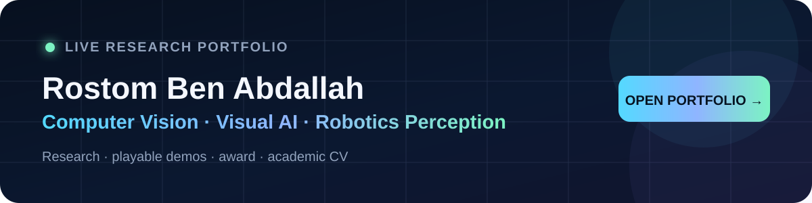

  

    

  
  
  
  

  
<strong>↑ Click the banner or “OPEN LIVE PORTFOLIO” to view the complete interactive research site.</strong>

# Rostom Ben Abdallah

**Industrial Computer Engineering | Computer Vision | Visual AI | Robotics Perception**

I am an Industrial Computer Engineering student at **ENET'Com** and a **Mitacs research intern at Université de Moncton**, working on applied computer vision for automated behavioural monitoring from video.

My core interests are **object detection, multi-object tracking, segmentation, re-identification, action recognition, video understanding, multimodal perception, and real-time/edge AI**.

## Research focus

### Multi-camera visual monitoring and behaviour understanding

My current research focuses on an end-to-end computer vision pipeline for behavioural analysis from multi-camera video. My contributions include:

- object / body detection
- multi-object tracking and temporal identity stabilization
- individual identification using visual cues
- segmentation and annotation-quality workflows
- large-scale video dataset preparation and evaluation
- temporal action / behaviour recognition
- model benchmarking on HPC infrastructure
- human-in-the-loop review and structured result export

**Research technologies:** Python, OpenCV, PyTorch, YOLO, RF-DETR, GroundingDINO, SAM, vision-language models, tracking / Re-ID methods, Linux, CUDA, Slurm/HPC.

> **Confidentiality note:** research data, internal code, trained models, private annotations, infrastructure details, and unpublished results from active collaborations are not published. Public material focuses on independently written, transferable engineering methods.

### Research case study

➡️ **[Multi-Camera Computer Vision for Animal Behaviour Understanding](portfolio/mitacs-animal-behavior-vision.md)**

This case study explains the research problem, system architecture, tracking / identity challenges, temporal behaviour-recognition workflow, HPC processing and human-review strategy without exposing confidential assets.

### Public-safe research demo

➡️ **[Temporal Animal Behaviour Pipeline Demo](demos/README.md)**  
A from-scratch synthetic demonstration of confidence-aware identity stabilization, per-track temporal windows, motion descriptors and structured CSV export. It contains no private research code or data.

## Featured applied computer vision demos

### [Industrial Computer Vision — Quality Control, Segmentation & Counting](https://github.com/Rostom-Ben-Abdallah/industrial-vision-quality-control)
A public engineering showcase with **three real-time vision demos** and shareable code:

- **[Bottle segmentation, counting & cap-quality inspection](https://github.com/Rostom-Ben-Abdallah/industrial-vision-quality-control/tree/main/projects/bottle-cap-inspection)** — YOLO instance segmentation, tracking, cap association, colour checking, OK/NG classification and one-time counting.
- **[Laser-marking quality control](https://github.com/Rostom-Ben-Abdallah/industrial-vision-quality-control/tree/main/projects/laser-marking-quality-control)** — OCR, position validation, CIEDE2000 colour checks and structured PASS/FAIL reporting.
- **[Medication segmentation & counting](https://github.com/Rostom-Ben-Abdallah/industrial-vision-quality-control/tree/main/projects/medication-counting)** — YOLOv11-seg, ByteTrack and ROI/hysteresis logic for reliable counting.

Short video demonstrations are included directly in the repository.

### [SafeVision — Multi-Camera Safety Perception](https://github.com/Rostom-Ben-Abdallah/safevision-multicamera-vision)
Multi-camera detection, tracking, pose analysis and event reasoning with structured alerts delivered to an augmented-reality client.

🏆 **2nd Place — DIGILOG Process Optimization Challenge (May 2025)** for the SIVAR / SafeVision project. [View the official certificate and recognition section](https://rostom-ben-abdallah.github.io/#award).

### [LLM-Guided TurtleBot3 — Vision, SLAM & Nav2](https://rostom-ben-abdallah.github.io/projects/turtlebot3.html)
ROS 2 Humble intelligent-robotics project combining **natural-language teleoperation, YOLOv8n scene understanding, SLAM mapping, Nav2 waypoint navigation, LiDAR safety logic and a PyQt operator dashboard** for TurtleBot3 Waffle Pi. Team project with Mohamed Benhasan, supervised by Mohamed Slim Masmoudi. [Public ROS 2 / vision code →](https://github.com/Rostom-Ben-Abdallah/robot-vision-llm-teleop)

### [Multi-Camera Tracking & Re-Identification](https://github.com/Rostom-Ben-Abdallah/multicamera-tracking-reid)
Applied prototype exploring live camera ingestion, detection/tracking, visual identity association, cross-camera concepts and temporal IN/OUT event reasoning.

➡️ **[Full Applied Computer Vision Portfolio](portfolio/applied-computer-vision.md)**

## Technical stack

**Languages**  
Python · C · C++ · Java

**Computer Vision / AI**  
OpenCV · PyTorch · YOLO · RF-DETR · GroundingDINO · SAM · MediaPipe · InsightFace · EasyOCR · Roboflow

**Tracking / Re-ID**  
ByteTrack · BoT-SORT · OSNet · temporal identity logic · ROI / event pipelines

**Deployment / Systems**  
Linux · CUDA/cuDNN · ONNX · Raspberry Pi · ESP32 · Git · HPC/Slurm · PyQt · Node-RED · ROS 2 · Nav2

## Research interests

I am especially interested in graduate research involving:

- computer vision for animal or human behaviour understanding
- action recognition and temporal video modelling
- multi-camera tracking and re-identification
- 2D / 3D perception and multimodal sensing
- robotic perception and autonomous systems
- computer vision for agriculture and industrial automation
- efficient real-time and edge deployment of visual AI

## Education

**Engineering Degree — Industrial Computer Engineering**  
National School of Electronics and Telecommunications of Sfax (ENET'Com)

**Bachelor's Degree — Automation and Industrial Computing**  
Higher Institute of Industrial Management of Sfax (ISGIS)

## Contact

- **Email:** rostom.ben.abdallah@umoncton.ca
- **LinkedIn:** [Rostom Ben Abdallah](https://www.linkedin.com/in/rostom-ben-abdallah-77bb441a1/)
- **Portfolio:** [rostom-ben-abdallah.github.io](https://rostom-ben-abdallah.github.io/)
- **CV (English):** [rostom-ben-abdallah.github.io/cv.html](https://rostom-ben-abdallah.github.io/cv.html)
- **CV (Français):** [rostom-ben-abdallah.github.io/cv-fr.html](https://rostom-ben-abdallah.github.io/cv-fr.html)
- **Location:** Sfax, Tunisia / currently conducting research in Canada

---

I am interested in **M.Sc. research opportunities in computer vision, video understanding, robotics perception, and applied AI**.
